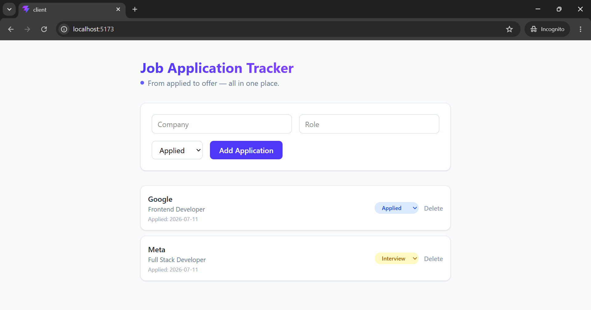

# Job Application Tracker

A full-stack MERN app to track job applications — company, role, status, and date applied — in one clean dashboard.

## Features
- Add new job applications through a simple form
- View all applications with status badges (Applied, Interview, Offer, Rejected)
- Built with React (Vite) + Tailwind CSS on the frontend, Express on the backend

## Tech Stack
- **Frontend:** React, Vite, Tailwind CSS, Axios
- **Backend:** Node.js, Express
- **Database:** MongoDB 

## Getting Started

### Backend
\`\`\`bash
cd server
npm install
node index.js
\`\`\`

### Frontend
\`\`\`bash
cd client
npm install
npm run dev
\`\`\`

## Screenshot
## Screenshot

